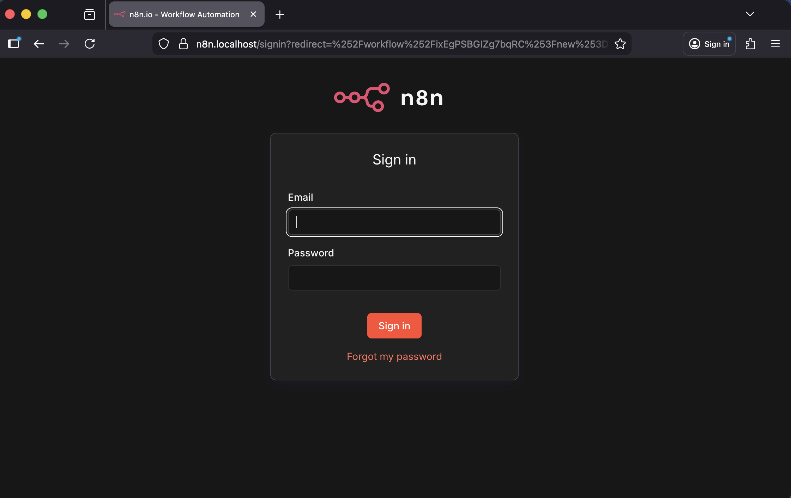

# n8n local with Docker, Caddy, and host PostgreSQL

This directory runs `n8n` and `caddy` in Docker and connects n8n to a PostgreSQL instance running on the host machine, outside Docker.

If this project helps you, you can support the work here:
- Buy Me a Coffee: https://buymeacoffee.com/

Security posture:
- this repository is intended for local development only
- the current PostgreSQL examples are convenience defaults, not production-safe defaults
- do not expose this stack directly to the public internet without revisiting authentication, TLS, and database access controls

Access URLs:
- `https://n8n.localhost`
- `http://127.0.0.1:5678` for local debug only

## Project structure

- `compose.yaml`: Docker Compose stack for `n8n` and `caddy`
- `.env`: n8n and PostgreSQL connection settings
- `Caddyfile`: local HTTPS reverse proxy for `n8n.localhost`
- `data/n8n`: persistent n8n application data
- `data/caddy/data`: Caddy certificates and CA state
- `data/caddy/config`: Caddy persistent config state
- `local-files`: local filesystem mount available to workflows
- `k8s/`: optional Kubernetes manifests for running n8n with an external PostgreSQL database

## Prerequisites

- Docker Desktop with Docker Compose
- PostgreSQL running on the host machine
- Database `n8n` already created
- A PostgreSQL user for n8n access
- `host.docker.internal` reachable from Docker containers

## Security warnings

Read this before using the stack as-is:
- using the `postgres` superuser from an application is not a good long-term default
- an empty PostgreSQL password is acceptable only for short-lived local testing
- broad `trust` rules in `pg_hba.conf` reduce friction locally, but they also reduce host-level safety
- trusting a local CA for development affects your machine trust store, so keep that trust local to your own workstation
- never commit `.env`, database dumps, `data/`, `certs/`, or private keys

Recommended minimum hardening, even for local development:
- create a dedicated database user such as `n8n_app`
- set a real password in `.env`
- restrict `pg_hba.conf` to the narrowest address range that Docker needs
- keep the repository private if it includes environment-specific operational details

## PostgreSQL requirements

This stack expects PostgreSQL outside Docker with:
- host: `host.docker.internal`
- port: `5432`
- database: `n8n`
- user: ideally a dedicated low-privilege user, not the `postgres` superuser
- password: set a real password unless you are doing short-lived local testing only

Confirm the local PostgreSQL setup before starting:

```bash
psql -h localhost -p 5432 -U postgres -d n8n
```

If the connection fails, check:
- `listen_addresses` includes the interface needed for TCP connections
- `pg_hba.conf` allows the connection method you want to use
- PostgreSQL is actually listening on port `5432`

To verify PostgreSQL is listening:

```bash
lsof -nP -iTCP:5432 -sTCP:LISTEN
```

### Bootstrap the database with Postgres.app

If you use Postgres.app on macOS, this repository includes a helper script to create a dedicated database user and the `n8n` database:

```bash
chmod +x scripts/create-postgres-db.sh
scripts/create-postgres-db.sh
```

Default values used by the script:
- admin user: `postgres`
- app database: `n8n`
- app user: `n8n_app`
- app password: `change_me_to_a_real_password`
- `N8N_ENCRYPTION_KEY`: generated automatically with `openssl rand -hex 32`

What the script does:
- creates or updates the PostgreSQL app user
- creates the `n8n` database if missing
- copies `.env.example` to `.env` if `.env` does not exist yet
- updates `.env` with `POSTGRES_USER`, `POSTGRES_PASSWORD`, `POSTGRES_DB`, and `N8N_ENCRYPTION_KEY` using `sed`

You can override them when needed:

```bash
APP_DB=n8n \
APP_USER=n8n_app \
APP_PASSWORD='replace_me' \
scripts/create-postgres-db.sh
```

## Local hostname

This setup uses `n8n.localhost`.

The `.localhost` domain is reserved for loopback use, so in most local environments you do not need to edit `/etc/hosts`.

Verify local name resolution before opening the browser:

```bash
python3 - <<'PY'
import socket
print(socket.gethostbyname('n8n.localhost'))
PY
```

Expected result:

```text
127.0.0.1
```

## Configuration

Review `.env` before starting:

```dotenv
POSTGRES_USER=postgres
POSTGRES_PASSWORD=
POSTGRES_DB=n8n
DB_POSTGRESDB_HOST=host.docker.internal
DB_POSTGRESDB_PORT=5432
N8N_ENCRYPTION_KEY=change_me_to_a_long_random_alpha_numeric_string
```

If you clone this repository elsewhere, start from the example file:

```bash
cp .env.example .env
```

Generate a strong encryption key before first real use:

```bash
openssl rand -hex 32
```

Then paste the generated value into:

```dotenv
N8N_ENCRYPTION_KEY=your_generated_value_here
```

Recommended local git safety setup:

```bash
git config core.hooksPath .githooks
chmod +x .githooks/pre-commit
```

Important:
- Replace `N8N_ENCRYPTION_KEY` with a long random value.
- Do not use `postgres` plus an empty password outside temporary local development.
- Prefer a dedicated PostgreSQL user with a real password.
- `localhost` is not correct inside the container for host PostgreSQL. Use `host.docker.internal`.

## Start the stack

```bash
docker compose up -d
```

Inspect the services:

```bash
docker compose ps
docker compose logs -f n8n
docker compose logs -f caddy
```

Validate the compose file before starting if needed:

```bash
docker compose config
```

## Kubernetes option

This repository also includes a minimal Kubernetes deployment option under `k8s/`.

What it covers:
- `n8n` deployment
- PVC for persistent n8n data
- ClusterIP service
- Ingress for `https://n8n.localhost`
- external PostgreSQL via Kubernetes Secret

What it does not cover:
- PostgreSQL inside the cluster
- cert-manager automation
- a bundled Ingress controller

Quick start:

```bash
kubectl apply -f k8s/namespace.yaml
cp k8s/secret.example.yaml k8s/secret.yaml
kubectl apply -f k8s/secret.yaml
kubectl apply -f k8s/pvc.yaml
kubectl apply -f k8s/deployment.yaml
kubectl apply -f k8s/service.yaml
kubectl apply -f k8s/ingress.yaml
```

See `k8s/README.md` for the intended assumptions and flow.

## Future updates and next steps

This project pins the n8n image version in `compose.yaml`. When you want to update in the future, review the pinned tag first and then refresh the stack in a controlled way.

## Release strategy

This repository now uses a standard public release approach:
- Semantic Versioning tags such as `v0.1.0`
- annotated git tags for releases
- `CHANGELOG.md` to track user-visible changes

Guidelines:
- use `MAJOR` for breaking changes
- use `MINOR` for backward-compatible features
- use `PATCH` for backward-compatible fixes
- use `0.x.y` while the project is still evolving rapidly

Older milestone tags such as `m0001` and release-like tags such as `r0001` are legacy markers. Going forward, prefer SemVer tags only.

Recommended update flow for this Docker Compose setup:

```bash
# from this project directory
docker compose pull
docker compose down
docker compose up -d
```

Before updating:
- review the n8n release notes for breaking changes
- check whether `compose.yaml` should move to a newer pinned n8n tag
- keep a backup of your PostgreSQL database and `data/n8n`

After updating:
- run `docker compose ps`
- inspect `docker compose logs -f n8n`
- open `https://n8n.localhost`
- verify that workflows, credentials, and webhook URLs still behave as expected

Useful official references:
- Docker image README: https://github.com/n8n-io/n8n/tree/master/docker/images/n8n
- Environment variable configuration: https://docs.n8n.io/hosting/configuration/environment-variables/
- Scaling and performance: https://docs.n8n.io/hosting/scaling/overview/
- Quickstarts: https://docs.n8n.io/try-it-out/quickstart/

## Access n8n

Open:

```text
https://n8n.localhost
```

This setup uses Caddy's local CA via `tls internal`. The practical goal is a trusted local HTTPS connection without browser warnings.

Example sign-in screen:



The Caddy container still stores runtime state under:
- `data/caddy/data`
- `data/caddy/config`

## Caddy, local certificates, and local Certificate Authority

This setup uses Caddy only as a minimal TLS terminator and reverse proxy in front of n8n.

In `Caddyfile`, the site is configured with:

```caddy
n8n.localhost {
	tls internal
	reverse_proxy n8n:5678
}
```

What this means:
- Caddy terminates HTTPS for `n8n.localhost`
- Caddy issues and serves a certificate from its own local development CA
- browsers may reject the certificate until that local CA is trusted on the host machine

This is useful for web development because:
- you can work locally over `https://`
- webhook URLs and OAuth flows behave more like a real environment
- you get a host-trusted certificate chain suitable for a normal browser lock icon

### Where the Caddy local CA lives

Persistent Caddy state is stored in:
- `data/caddy/data`
- `data/caddy/config`

The local CA material generated by Caddy is stored under `data/caddy/data`.

If you need to verify that the local CA files exist:

```bash
ls -la data/caddy/data/caddy/pki/authorities/local/
```

Once the CA is trusted by the host, `https://n8n.localhost` should load as a trusted local HTTPS endpoint.

### Green lock on macOS

If you want the browser to trust `https://n8n.localhost`, the Caddy local CA used to sign it must be trusted by macOS.

The relevant CA file is:

```text
data/caddy/data/caddy/pki/authorities/local/root.crt
```

You can trust it in the login keychain with:

```bash
security add-trusted-cert \
  -d \
  -r trustRoot \
  -k ~/Library/Keychains/login.keychain-db \
  "$(pwd)/data/caddy/data/caddy/pki/authorities/local/root.crt"
```

After that:
- fully quit and reopen the browser
- open `https://n8n.localhost`

If the lock still does not appear:
- confirm `n8n.localhost` resolves to `127.0.0.1`
- make sure the browser is using the macOS trust store

### Regenerating local certificates

If you want Caddy to issue a fresh local CA and certificate set, stop the stack and remove the persisted Caddy state:

```bash
docker compose down
rm -rf data/caddy/data data/caddy/config
mkdir -p data/caddy/data data/caddy/config
docker compose up -d
```

Then trust the newly generated root certificate again on your machine.

## Git and security safeguards

This repository includes a few guardrails for local development:
- `.gitignore` excludes `.env`, `data/`, `certs/`, `local-files/`, and `bin/`
- `.env.example` provides a safe template for configuration
- `.gitattributes` normalizes text files and marks certificate material as binary
- `.githooks/pre-commit` blocks common secret and local-only files from being committed
- `.github/workflows/ci.yml` validates the Compose file and checks for tracked secret-like files

These guardrails reduce common mistakes, but they do not replace manual review before pushing or publishing a fork.

Enable the repository-local git hook after cloning:

```bash
git config core.hooksPath .githooks
chmod +x .githooks/pre-commit
```

### Development note

This certificate model is for local development only. Do not reuse this local Caddy CA setup for public production traffic.

## Persistence

Persistent local data lives in this directory:
- n8n data: `data/n8n`
- Caddy state: `data/caddy/data`
- Caddy config state: `data/caddy/config`
- workflow local files: `local-files`

You can stop and start the containers without losing n8n state:

```bash
docker compose down
docker compose up -d
```

## Troubleshooting

### n8n cannot connect to PostgreSQL

Symptoms:
- `ECONNREFUSED`
- authentication errors
- migrations failing during startup

Checks:
- confirm PostgreSQL is running on the host
- confirm `psql -h localhost -p 5432 -U postgres -d n8n` works
- confirm `.env` still points to `host.docker.internal`
- confirm PostgreSQL accepts TCP connections without a password for this user

### `host.docker.internal` does not resolve

Test from a disposable container:

```bash
docker run --rm alpine:3.22 getent hosts host.docker.internal
```

If it does not resolve, Docker Desktop may not be running correctly, or your Docker environment may not expose the host gateway alias as expected.

### `n8n.localhost` does not resolve

Check local resolution:

Then verify:

```bash
curl -k https://n8n.localhost
```

If `curl -k --resolve n8n.localhost:443:127.0.0.1 https://n8n.localhost` works but `curl -k https://n8n.localhost` does not, the problem is local hostname resolution, not Docker, Caddy, or n8n.

### Certificate warning in browser

This is expected until you trust the local CA generated by Caddy. The relevant file is `data/caddy/data/caddy/pki/authorities/local/root.crt`.

### Caddy starts but n8n is unavailable

Check container logs:

```bash
docker compose logs -f n8n
docker compose logs -f caddy
```

If n8n is failing during startup, the most likely cause is PostgreSQL connectivity or authentication.
